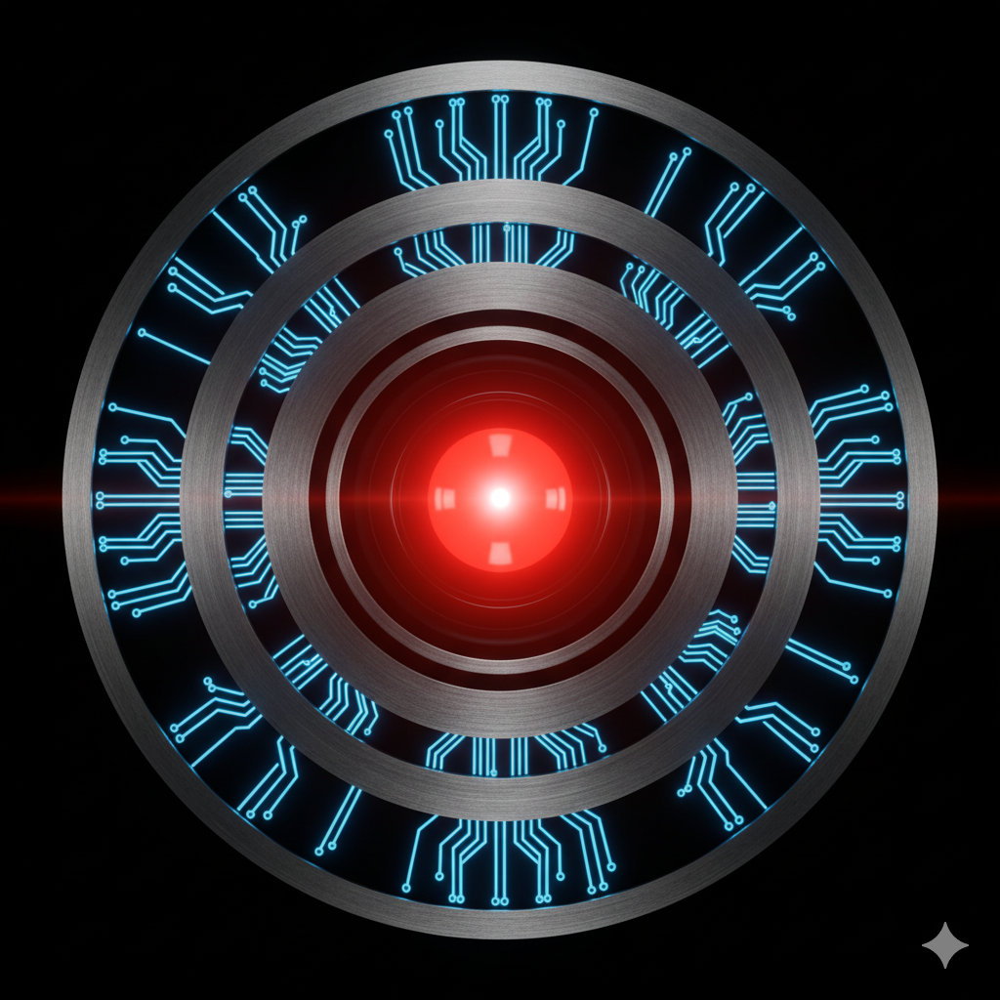

<div align="center">

<pre>
=============================================================================
     *** <----   D I S C O V E R Y   O N E   ----> ***
=============================================================================
</pre>

<p><em>Our 'Project Level Up' DevOps mission.</em></p>
<p>
   
   
</p>
</div>
<p align="center">
  <a href="https://cloud.google.com" target="_blank" rel="noreferrer">
    
  </a>
  <a href="https://www.terraform.io" target="_blank" rel="noreferrer">
    
  </a>
  <a href="https://www.nginx.com" target="_blank" rel="noreferrer">
    
  </a>
 <a href="https://github.com/features/codespaces" target="_blank" rel="noreferrer">
    
  </a>
</p>

## 🚀 MISSION LOG -->

This repository serves as the mission log for **DiscoveryOne**, charting our 'Project LeveL Up' journey into DevOps.

Our objectives are critical and designed to be fully operational and error-free.

## 📋 MISSION SCOPE ---->

- **PAYLOAD:** Prepare and deploy a core application (e.g., Nginx or Flask API).
- **INFRASTRUCTURE:** Configure autonomous infrastructure with auto-healing and auto-scaling.
- **DIAGNOSTICS:** Implement system monitoring and perform critical load testing (e.g., `ab` or `curl`).
- **ANALYSIS:** Investigate the cost-impact of scaling operations and prepare a detailed report.

## 📋 MISSION ROLES ------>

  <div align="center">
  <pre>
   __   ___| |_ _ __ ___  _ __   __ _ _   _| |_ ___ 
  / _` / __| __| '__/ _ \| '_ \ / _` | | | | __/ __|
 |(_| \__ \ |_| | | (_) | | | | (_| | |_| | |_\__ \
  \__,_|___/\__|_|  \___/|_| |_|\__,_|\__,_|\__|___/ 
</pre>
</div>

### 👩‍🚀Person A — Cloud Network Architect \*

- Primary task: Build a secure, segmented networking foundation (VPC, subnets, firewall rules) and manage identity (IAM).
- Dependencies: Must deliver the network structure and IAM roles before others can deploy resources.

### 👩‍🚀Person B — Application Engineer \*\*

- Primary task: Prepare the application (Task 1) and automate it in an Instance Template.
- Dependencies: Requires network/subnet names and a service account from Person A.

### 👩‍🚀Person C — Infrastructure Engineer \*\*\*

- Primary task: Build scalability and availability components (Task 2: MIG, Load Balancer, SSL, autoscaling, autohealing).
- Dependencies: Requires the Instance Template from Person B and firewall rules for health checks from Person A.

### 👩‍🚀Person D — Observability (SRE) Engineer \*\*\*\*

- Primary task: Implement monitoring and alerts (Task 3, part 1).
- Dependencies: Requires a functioning infrastructure (MIG, LB) from Person C to monitor.

### 👩‍🚀Person E — Performance & FinOps Analyst **\***

- Primary task: Conduct load testing (Task 3, part 2) and prepare a cost–performance report (Task 4).
- Dependencies: Requires a fully operational and monitored system (from Persons C and D) and access to billing data.

## 🧭 OPERATIONAL DIRECTIVE & STRUCTURE -------->

**Proposal:**
Try to deliver working V1 version first, inspired by Ania's:

https://github.com/aniaodprogramowania/005_LB_01_MIG

Everyone can make better V2 version later if we have time.

**Proposal:**
Folder structure:

- Each major version in separate folder (V1, V2, etc.)
- Each task is split into separate file

```plaintext
/V1
  ├── 00_variables.md
  ├── 01_network.md
  ├── 02_application.md
  ├── 03_infrastructure.md
  ├── 04_observability.md
  └── 05_finops.md
```

## 🗺️ CURRENT ROSTER ---------->

All tasks assignments are up to discussion.
Preliminary ones:

- 👩**Agnieszka _(Everestia)_** - _tasks A, B, C, E_
- 👩**Aneta** - _second Hal 9000 victim_☠️
- 👩**Adrianna** - _task D_
- 👩**Karolina G** - _Hal 9000 survivor (escape pod)_💚
- 👩**Karolina** - _first Hal 9000 victim_☠️

Mission Control: 
- 🤖👩‍🚀 **Anna _(aniaodprogramowania)_** -_"Ann, we have a problem"_
---

<table align="center">
<tr>
<td>

```diff
+ "I'm sorry, Ann, I'm afraid I can't let you push directly to 'main'." (HAL 9000)
```
</td>
</tr>
</table>

<div align="center">
  
</div>

