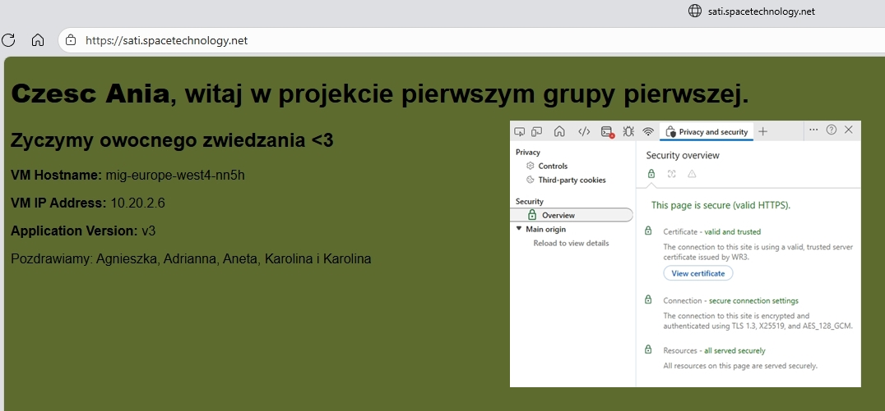
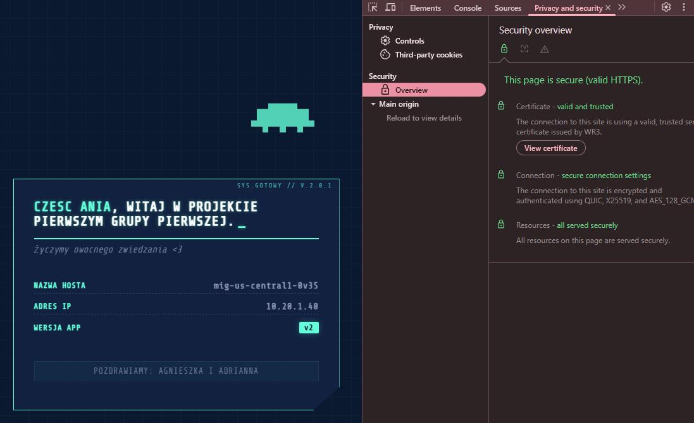
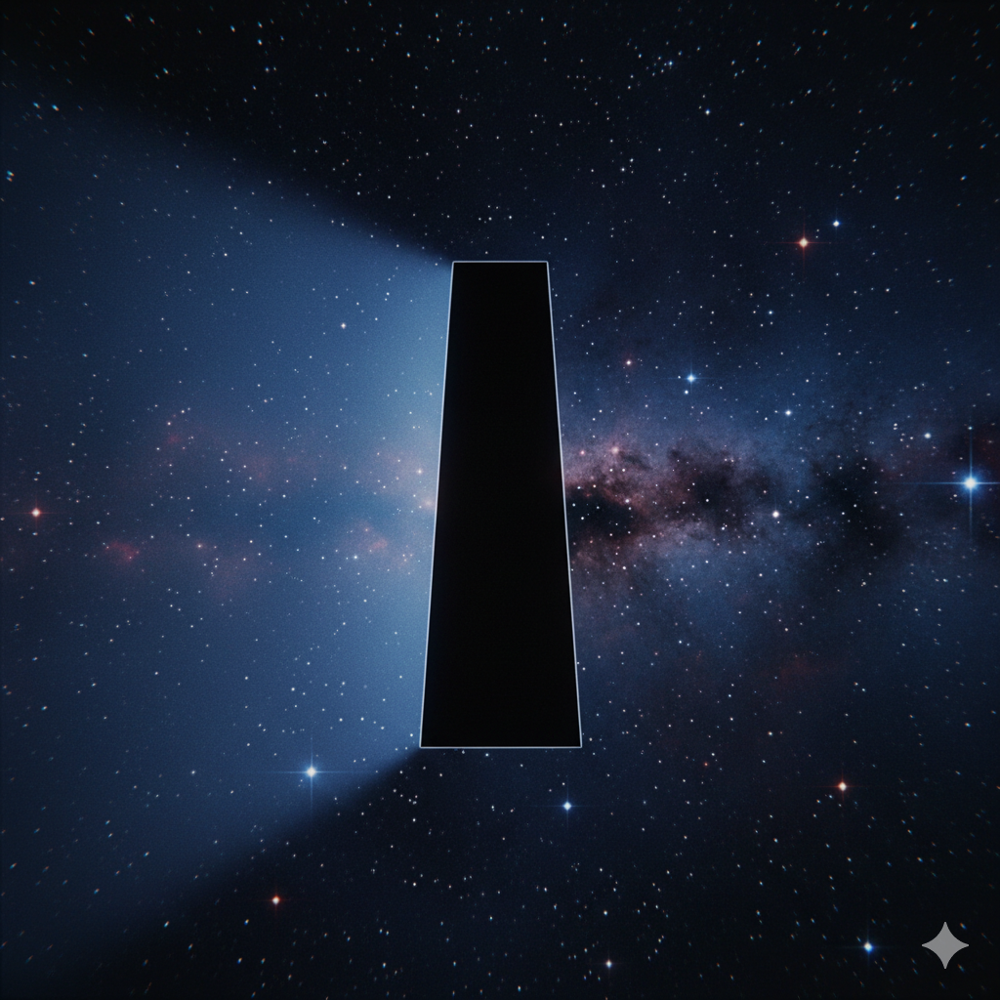

<div align="center">

<pre>
=============================================================================
   // DEPLOYMENT PROCEDURE: PAYLOAD (TASK 0) //
=============================================================================
</pre>

<p><em>This document outlines the procedure for deploying the core application payload (Nginx).</em></p>

</div>

---

### 🛰️ Step 1a: Prepare Application Payload (cloud-init)

This first step creates the configuration file for our virtual machine.

> **[RATIONALE: Why use cloud-init?]**
> We are using `cloud-init` because it is the modern standard for bootstrapping cloud instances.
> * **It is declarative:** Much like Terraform, we *declare* the state we want (e.g., "nginx installed," "this file exists"), and `cloud-init` figures out *how* to do it.
> * **It is compatible:** It works perfectly on our chosen OS, Ubuntu 24.04 LTS, and is supported by all major cloud providers.
> * **It is clean:** It keeps our VM templates simple, as the VM only needs to fetch this one script on its first boot.
---
**Action:**
The following command creates a `cloud-init.yaml` file in our directory. This file instructs the new VM to update packages, install Nginx, and create a custom webpage.

#### Beta release:

```bash
##VARIABLES
#Cloud-init config
cat << 'EOF' > "cloud-init.yaml"
#cloud-config
# version: 1.2.0  (2025-11-20)
# owner: Sati
# change: team rooster updated after HAL rampage
# scope: -
package_update: true
packages:
  - nginx
write_files:
  - path: /var/www/html/index.html
    permissions: '0644'
    content: |
      <!DOCTYPE html>
      <html>
        <body style="background-color:rgb(94,107,47); font-family:sans-serif;">
          <h1><b>Czesc Ania</b>, witaj w projekcie pierwszym grupy pierwszej.</h1>
          <h2>Zyczymy owocnego zwiedzania &lt;3 </h2>
          <p><strong>VM Hostname:</strong> ##MY_HOSTNAME##</p>
          <p><strong>VM IP Address:</strong> ##MY_IP_ADDRESS##</p>
          <p><strong>Application Version:</strong> v4 </p>
          <p>Pozdrawiamy: Agnieszka i Adrianna </p>
        </body>
      </html>
runcmd:
  - |
    #!/bin/bash
    HNAME=$(hostname)
    IP_ADDR=$(hostname -I)
    sed -i "s/##MY_HOSTNAME##/$HNAME/g" /var/www/html/index.html
    sed -i "s/##MY_IP_ADDRESS##/$IP_ADDR/g" /var/www/html/index.html
    systemctl enable --now nginx
EOF
```

#### Final Release:

```bash
#Cloud-init config
cat << 'EOF' > "cloud-init.yaml"
#cloud-config
# version: 2.0.2  (2025-11-23)
# owner: Sati
# change: Space, animations, starships, fixed encoding!
package_update: true
packages:
  - nginx
write_files:
  - path: /var/www/html/index.html
    owner: www-data:www-data
    permissions: '0644'
    content: |
      <!DOCTYPE html>
      <html lang="pl">
      <head>
        <meta charset="UTF-8">
        <meta name="viewport" content="width=device-width, initial-scale=1.0">
        <title>Mission Status</title>
        <link href="https://fonts.googleapis.com/css2?family=Share+Tech+Mono&display=swap" rel="stylesheet">
        <style>
          :root {
            --primary-color: #64ffda;
            --secondary-color: #8892b0;
            --bg-color: #0a192f;
            --panel-bg: rgba(17, 34, 64, 0.95);
            --grid-line-color: rgba(100, 255, 218, 0.03);
          }
          body {
            margin: 0; padding: 20px; min-height: 100vh; box-sizing: border-box;
            display: flex; justify-content: center; align-items: center;
            background-color: var(--bg-color);
            background-image: 
              linear-gradient(var(--grid-line-color) 1px, transparent 1px),
              linear-gradient(90deg, var(--grid-line-color) 1px, transparent 1px);
            background-size: 30px 30px;
            font-family: 'Share Tech Mono', monospace;
            color: var(--secondary-color);
            overflow: hidden;
            position: relative;
          }
          /* --- FIXED 90s SPACESHIP --- */
          .retro-spaceship {
            position: absolute;
            top: 15%;
            left: -100px; 
            width: 100px;
            height: 60px;
            /* SVG embedded directly */
            background-image: url("data:image/svg+xml;charset=UTF-8,%3Csvg xmlns='http://www.w3.org/2000/svg' viewBox='0 0 11 6' shape-rendering='crispEdges'%3E%3Cpath fill='%2364ffda' d='M3,0 h5 v1 h-5 Z M1,1 h9 v2 h-9 Z M0,3 h11 v1 h-11 Z M2,4 h1 v1 h-1 Z M5,4 h1 v1 h-1 Z M8,4 h1 v1 h-1 Z' /%3E%3C/svg%3E");
            background-size: contain;
            background-repeat: no-repeat;
            z-index: 0;
            opacity: 0.8;
            animation: retroFlyBy 15s linear infinite;
          }
          @keyframes retroFlyBy {
            0% { left: -150px; transform: translateY(0px); }
            25% { transform: translateY(-30px); }
            50% { transform: translateY(0px); }
            75% { transform: translateY(30px); }
            100% { left: 110vw; transform: translateY(0px); }
          }
          .hud-container {
            position: relative; width: 100%; max-width: 450px; padding: 2rem;
            background: var(--panel-bg); border: 1px solid var(--primary-color);
            box-shadow: 0 0 20px rgba(100, 255, 218, 0.15);
            clip-path: polygon(0 0, 100% 0, 100% 90%, 92% 100%, 0 100%, 0 8%);
            z-index: 1; 
          }
          .hud-container::before {
            content: "SYS.GOTOWY // V.2.0.2"; 
            position: absolute; top: 5px; right: 10px; font-size: 0.6rem;
            color: var(--primary-color); opacity: 0.6; letter-spacing: 2px;
          }
          h1 {
            font-size: 1.3rem; color: #fff; margin: 0 0 0.5rem 0;
            text-transform: uppercase; letter-spacing: 1px;
            border-bottom: 2px solid var(--primary-color); padding-bottom: 15px;
            text-shadow: 0 0 5px rgba(100, 255, 218, 0.5);
          }
          h1 b { color: var(--primary-color); }
          h2 {
            font-size: 0.9rem; color: var(--secondary-color);
            margin-top: 0; margin-bottom: 2.5rem;
            font-weight: normal; font-style: italic; opacity: 0.8;
          }
          .data-row {
            font-size: 0.9rem; margin: 12px 0; display: flex;
            justify-content: space-between; align-items: center;
            border-bottom: 1px dashed rgba(136, 146, 176, 0.3); padding-bottom: 4px;
          }
          .data-label {
            color: var(--primary-color); text-transform: uppercase;
            font-size: 0.75rem; letter-spacing: 1px; font-weight: bold;
          }
          .data-value { font-weight: bold; letter-spacing: 0.5px; }
          .version-tag {
            background: var(--primary-color); color: var(--bg-color);
            padding: 2px 8px; font-weight: bold; border-radius: 2px;
            font-size: 0.8rem; box-shadow: 0 0 10px rgba(100, 255, 218, 0.3);
          }
          .footer-sig {
            margin-top: 2.5rem; text-align: center; font-size: 0.8rem; opacity: 0.7;
            background: rgba(100, 255, 218, 0.05); padding: 8px;
            border: 1px solid rgba(100, 255, 218, 0.1);
            text-transform: uppercase; letter-spacing: 1px;
          }
          @keyframes blink { 50% { opacity: 0; } }
          .cursor-effect::after {
            content: "_"; animation: blink 1s step-start infinite;
            color: var(--primary-color); margin-left: 5px;
          }
        </style>
      </head>
      <body>
        <div class="retro-spaceship"></div>
        <div class="hud-container">
          <h1 class="cursor-effect"><b>Czesc Ania</b>, witaj w projekcie pierwszym grupy pierwszej.</h1>
          <h2>Życzymy owocnego zwiedzania &lt;3 </h2>
          <div class="data-row">
              <span class="data-label">Nazwa Hosta</span>
              <span class="data-value">##MY_HOSTNAME##</span>
          </div>
          <div class="data-row">
              <span class="data-label">Adres IP</span>
              <span class="data-value">##MY_IP_ADDRESS##</span>
          </div>
          <div class="data-row" style="border-bottom: none;">
              <span class="data-label">Wersja App</span>
              <span class="data-value version-tag">v2</span>
          </div>
          <p class="footer-sig">Pozdrawiamy: Agnieszka i Adrianna</p>
        </div>
      </body>
      </html>
runcmd:
  - |
    #!/bin/bash
    # 1. Force Nginx to use UTF-8 for Polish characters
    # We use | as a delimiter for sed to avoid escaping slashes
    sed -i 's|http {|http {\n    charset utf-8;|' /etc/nginx/nginx.conf
    # 2. Inject Hostname and IP
    # Using variables here is cleaner and safer in a script block
    HNAME=$(hostname)
    IP_ADDR=$(hostname -I | awk '{print $1}')
    sed -i "s/##MY_HOSTNAME##/$HNAME/g" /var/www/html/index.html
    sed -i "s/##MY_IP_ADDRESS##/$IP_ADDR/g" /var/www/html/index.html
    # 3. Restart Nginx to apply config changes
    systemctl enable --now nginx
    systemctl restart nginx
EOF
```


---
### 🛰️ Step 1b: Create Startup Script for Cloud Ops Agent

> **[ RATIONALE: Ops Agent Installation ]**
> The startup script runs *after* cloud-init completes and installs the Google Cloud Ops Agent for monitoring and logging.

**Action:**
Create the `ops-agent-startup.sh` file.

```bash
cat << 'EOF' > ops-agent-startup.sh
#!/bin/bash
curl -sSO https://dl.google.com/cloudagents/add-google-cloud-ops-agent-repo.sh
sudo bash add-google-cloud-ops-agent-repo.sh --also-install
EOF
```
---
```Diff
+ ✨🪐🛸CUSTOM WEBPAGE SCREENSHOT🛸🪐✨
```

#### Beta:

<div align="center">
  
</div>

#### Final release:

<div align="center">
  
</div>

---

### ⚙️ Step 2: Set Mission Parameters (Variables)
Next, we export our environmental variables.

> **[ RATIONALE: Why use variables? ]**
> This separates our configuration (the "what," e.g., `vpc1-custom`) from our logic (the "how," e.g. ,`gcloud compute networks create`).
> * **It's safer:** It prevents typos and mistakes.
> * **It's collaborative:** Everyone on the team can use the same script and just `change their project variable if needed`.
> * **It's reusable:** We can easily reuse these scripts for a different project (V2) just by sourcing a different variable file.
---
```diff
- Note: The project variable must be changed, as each GCP Project ID is globally unique.
```
**Action:** Run these `export commands` in your terminal. They will be available for the duration of your terminal session.

```bash
export project=levelup-sati-t1
export regionus=us-central1 #because it is cheap
export regioneu=europe-west4 #beacuse it is in Europe
export healthchecktag=lb-health-checks-enabled
export healthcheckname=global-http-health-check
export vpc=vpc1-custom
export subnetus=subnet-us-central1
export subneteu=subnet-eu-west4
```
---
### 🔧 Step 3: Project Initialization (Optional)

<table align="centre">
<tr>
<td>
------ * ------ * ---
This step is for a "cold start" mission,
where the project does not exist yet.
------ * ------ * ---
</td>
</tr>
</table>

```diff
- Note: [!WARNING] Do not run this if your project already exists!
```
> **[ RATIONALE: When to use this? ]** 
> * **This is a one-time setup command**: The `gcloud config set project` command is a convenience that tells `gcloud` which project to use for all subsequent commands.
> * That's why: you don't have to add `--project=$project` to every command.
---
**Action:** (Optional) Run the following to create and configure the new project.

```bash
# Create new project
gcloud projects create $project
# now switch to project and define variables
# Set newly created project as default for cli convnience
gcloud config set project $project
```
---
### 🧹 Step 4: Post-Mission Cleanup (Optional)
This final step removes temporary files from your local directory.

> **[ RATIONALE: Why clean up? ]**
> * This step is **optional**. Its purpose is to clean up temporary files created during the deployment process (like `cloud-init.yaml`).

> You should run this when you want to "start from scratch" for a future deployment, ensuring that no old, auto-generated files are left behind. The `cloud-init.yaml` is a *temporary artifact* generated by Step 1; it is not meant to be saved in the repository.

**Action:**
Remove the temporary `cloud-init.yaml` file.

```bash
rm cloud-init.yaml
```
---
<table align="center">
<tr>
<td>

```diff
+ "I'm completely operational, and all my circuits are functioning perfectly (HAL 9000)."
```
<div align="center">
  
</div>
