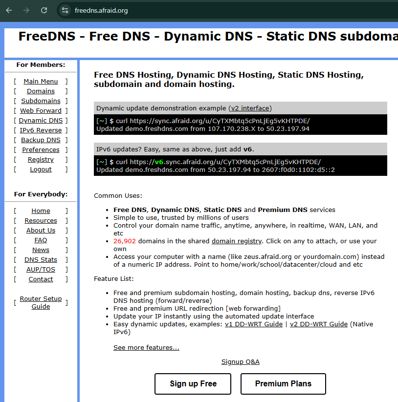
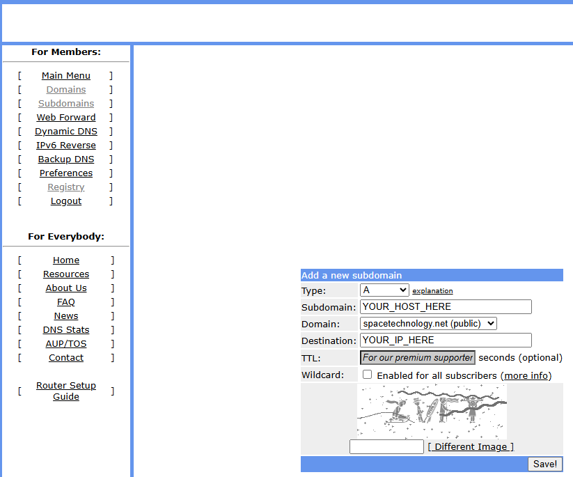
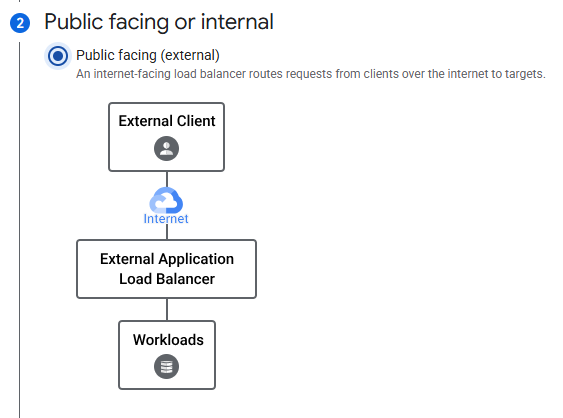
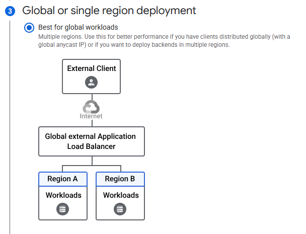
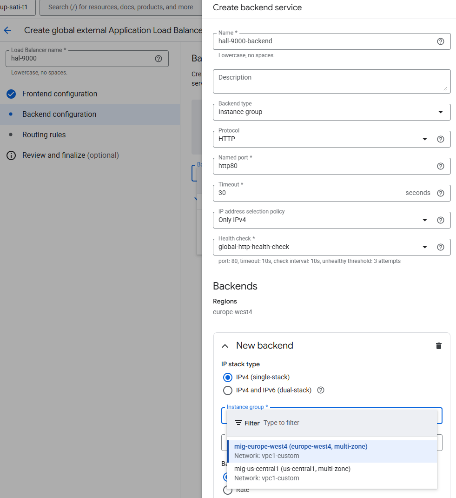
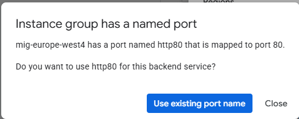
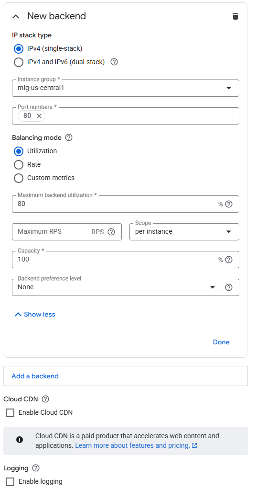
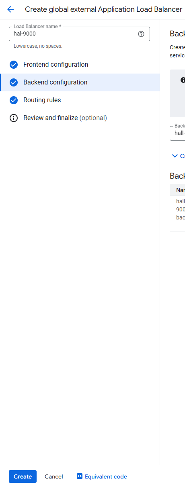

## DNS & IP

### Reserve static IP in GCP

gcloud compute addresses create lb-external-static-ip  --global

gcloud compute addresses describe lb-external-static-ip --global

### Reserve hostname on afraid.org

Create an account on afraid.org

Confirm your account (email).

Navigate to https://freedns.afraid.org/domain/registry/ to find domian you would like to use. Make sure to select one marked as public, otherwise you will have to wait for approval:

Click on domain name, then on the next page put: 
- Subdomain: your preferred hostname
- Destination: external IP you reserved for your loadbalancer

Wait 15-30 minutes for your domain to become globally reachable.

## Loadbalancer setup
In GCP web console navigate to Network Services / Load balancing and press Create load balancer:

Select Application Load Balancer (HTTP/HTTPS):

Select external:

Select global:

Select Global external Application Load Balancer:

Then press Configure.

In the next page, provide:
- name for your loadbalancer
- name for your frontend
- Protocol: set to HTTPS
- IP address: Select IP we selected before.  

In certificate selection field, press "Create a new certificate: 

On next page, provide name for your cert, domain you registered on afraid.org and select "Create Google-managed certificate", then press Create.

Almost there, now click to Backend configuration and "Create a backend service":

Then:
 - add name for your backend service
 - select existing global healthcheck
 - Select existing MIG in Backends/Instance group:

Use existing named prot when prompted:

Press Add a backend and select second MIG:
 

Finally, uncheck "Enable Cloud CDN":

and press Create on Create backend service subpage.

Press final "Create":

After a few minutes, your loadbalancer should be active.
