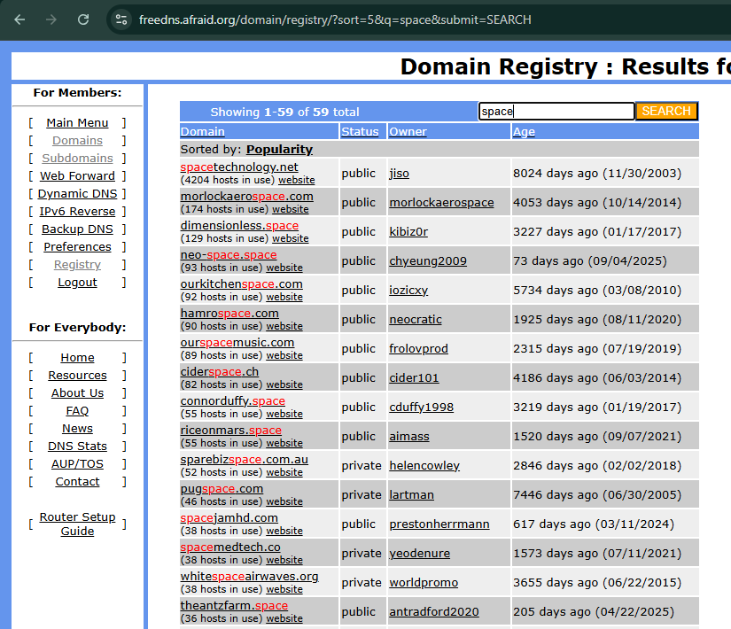
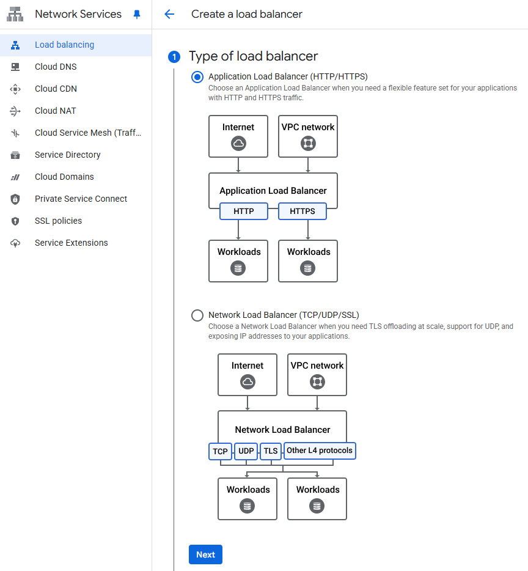
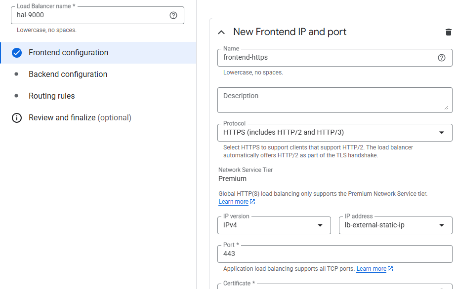
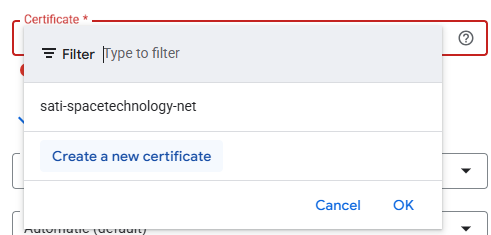
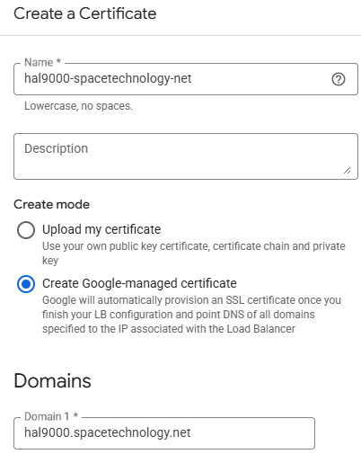
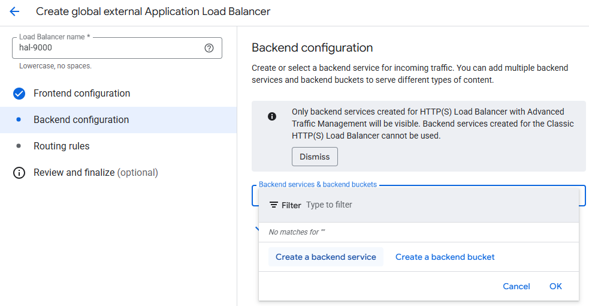
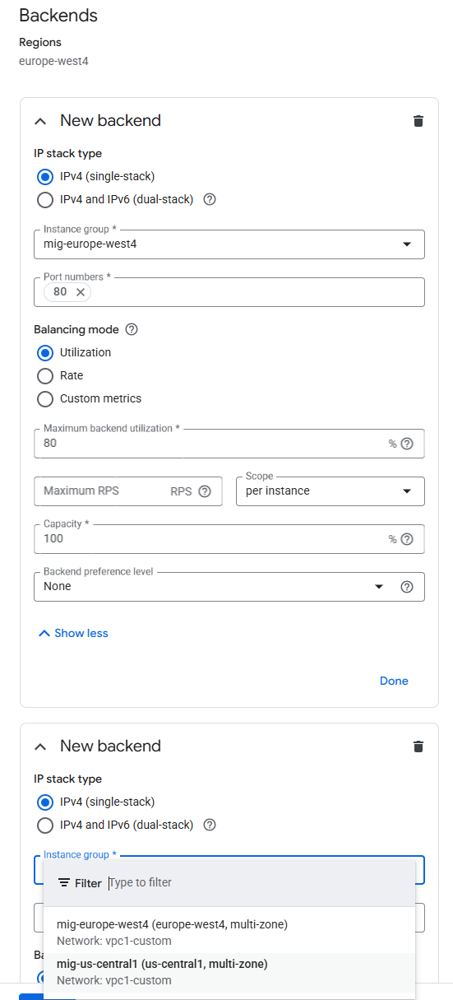

<div align="center">

<pre>
=============================================================================
  // DEPLOYMENT PROCEDURE: DNS & LOAD BALANCER (TASK C) //
=============================================================================
</pre>

<p><em>This document describes how to configure DNS, IP addressing and the external HTTP(S) Load Balancer in front of the compute layer.</em></p>

</div>

---
> **💫[!NOTE]💫👩‍🚀👩‍🚀👩‍🚀**

```Diff
+ Operator's Log:
```
> * This procedure assumes that the **compute layer** from `02_application.md` is already deployed.
> * The goal is to expose the application via a **global HTTPS endpoint** backed by the two regional MIGs.
> * GUI steps are documented with screenshots captured from the GCP Console.

---

## 🌐📡 Step 0: DNS & IP (Public Entry Point)

> **[ RATIONALE: Public Entry Point ]**
> * Reserve a **global static IP** for the HTTP(S) Load Balancer.
> * Map that IP to a **DNS hostname** (e.g. using `freedns.afraid.org`).
> * This hostname will later be referenced in the HTTPS certificate configuration on the load balancer.


### Reserve static IP in GCP

```bash
gcloud compute addresses create lb-external-static-ip  --global

gcloud compute addresses describe lb-external-static-ip --global
```


### Reserve hostname on afraid.org

Create an account on afraid.org

Confirm your account (email).


Navigate to https://freedns.afraid.org/domain/registry/ to find a domain you would like to use. 
Tip: Make sure to select one marked as public, otherwise you will have to wait for approval:


Click on domain name, then on the next page put: 
- Subdomain: your preferred hostname
- Destination: external IP you reserved for your loadbalancer


Wait 15-30 minutes for your domain to become globally reachable.

## 🚦 Step 1: External HTTPS Load Balancer

> **[ RATIONALE: Global HTTPS Frontend ]**
> * Use an **External Application Load Balancer** to front both regional MIGs.
> * Terminate **HTTPS** at the edge using a Google-managed certificate.
> * Reuse the **global health check** and the **US/EU MIGs** created in `02_application.md` as backends.


In GCP web console navigate to Network Services / Load balancing and press Create load balancer:


Select Application Load Balancer (HTTP/HTTPS):



Select Public facing (external):


Select Best for global workloads:


Select Global external Application Load Balancer:


Then press Configure.

In the next page, provide:
- name for your loadbalancer
- name for your frontend
- Protocol: set to HTTPS
- IP address: Select static IP we created before.  




In certificate selection field, press "Create a new certificate: 




On next page, provide name for your certificate, domain you registered on afraid.org and select "Create Google-managed certificate", then press Create:




Almost there, now click to Backend configuration and "Create a backend service":



Then:
 - Add name for your backend service
 - Select existing global healthcheck
 - Select existing MIG in Backends/Instance group:


Use existing named prot when prompted:


Press Add a backend and select second MIG:

 

Finally, uncheck "Enable Cloud CDN":


and press Create on Create backend service subpage.


Press final "Create":


After a few minutes, your loadbalancer should be **active**.