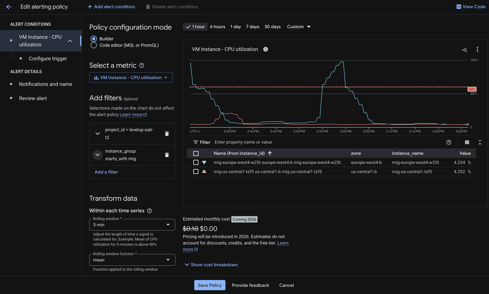
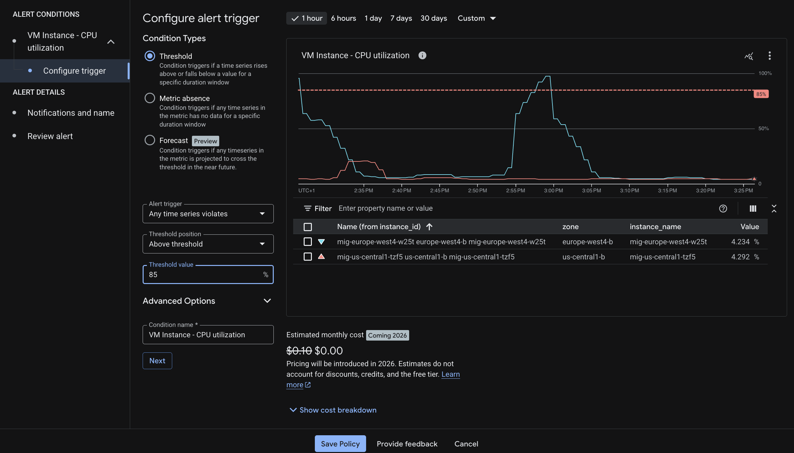
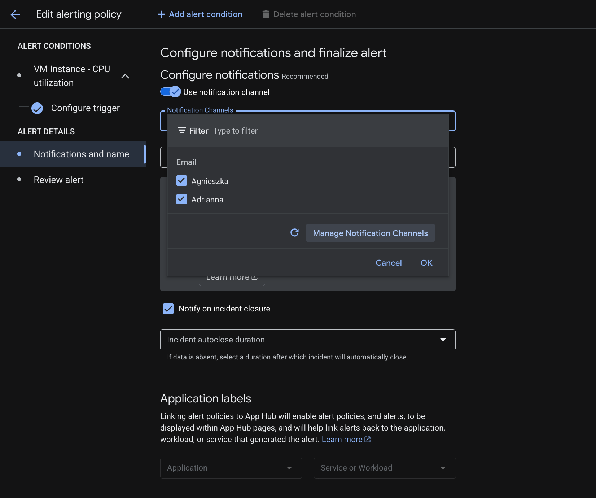
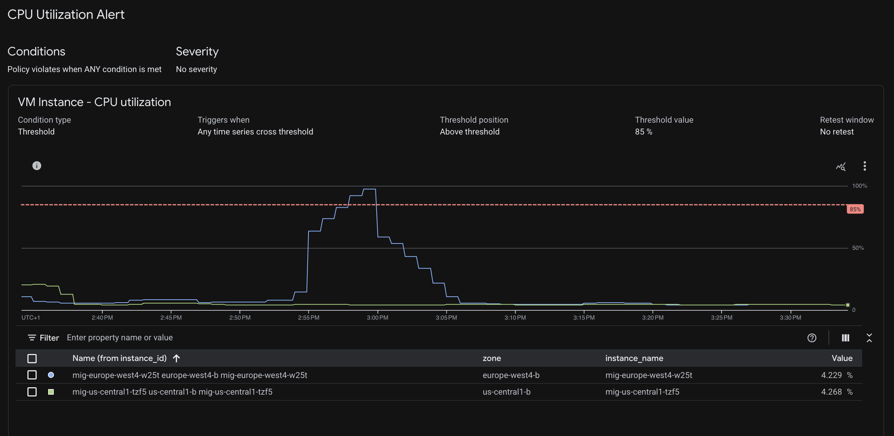

<div align="center">

<pre>
=============================================================================
  // DEPLOYMENT PROCEDURE: OBSERVABILITY (TASK D) //
=============================================================================
</pre>

<p><em>This document describes how to deploy and setup Ops Agent, configure alerting and monitoring dashboards.</em></p>

</div>

---
> **💫[!NOTE]💫👩‍🚀 _(Adrianna - second HAL 9000 survivor)_** 👾❤️‍🔥

```Diff
+ Operator's Log:
```
> * This procedure assumes that **previous layers** are already deployed.
> * GUI steps are documented with screenshots captured from the GCP Console.
---

### 🛰️ Step 1 : Create Startup Script for Cloud Ops Agent

> **[ RATIONALE: Ops Agent Installation ]**
> The startup script runs *after* cloud-init completes and installs the Google Cloud Ops Agent for monitoring and logging. it's passed in as metadata during creation of the instance template 

```
  --metadata-from-file=user-data=cloud-init.yaml,startup-script=ops-agent-startup.sh \
```

**Action:**
Create the `ops-agent-startup.sh` file.

```bash
cat << 'EOF' > ops-agent-startup.sh
#!/bin/bash
curl -sSO https://dl.google.com/cloudagents/add-google-cloud-ops-agent-repo.sh
sudo bash add-google-cloud-ops-agent-repo.sh --also-install
EOF
```

### 🛰️ Step 2 : Create A Custom Dashboard 
> **[ RATIONALE: Custom Dashboard via Json ]**
> The custom dashboard would be created using the Json payload below

```json
{
  "displayName": "HAL9000v2 Infrastructure Status (Final)",
  "gridLayout": {
    "columns": "2",
    "widgets": [
      {
        "title": "Global LB Traffic (Req/Sec)",
        "xyChart": {
          "dataSets": [
            {
              "timeSeriesQuery": {
                "timeSeriesFilter": {
                  "filter": "metric.type=\"loadbalancing.googleapis.com/https/request_count\" resource.type=\"https_lb_rule\" resource.label.url_map_name=\"hal9000v2\"",
                  "aggregation": {
                    "perSeriesAligner": "ALIGN_RATE",
                    "crossSeriesReducer": "REDUCE_SUM",
                    "alignmentPeriod": "60s",
                    "groupByFields": []
                  }
                }
              },
              "plotType": "LINE",
              "minAlignmentPeriod": "60s"
            }
          ],
          "timeshiftDuration": "0s",
          "yAxis": {
            "label": "y1Axis",
            "scale": "LINEAR"
          }
        }
      },
      {
        "title": "Global LB Latency (95th Percentile)",
        "xyChart": {
          "dataSets": [
            {
              "timeSeriesQuery": {
                "timeSeriesFilter": {
                  "filter": "metric.type=\"loadbalancing.googleapis.com/https/total_latencies\" resource.type=\"https_lb_rule\" resource.label.url_map_name=\"hal9000v2\"",
                  "aggregation": {
                    "perSeriesAligner": "ALIGN_DELTA",
                    "crossSeriesReducer": "REDUCE_PERCENTILE_95",
                    "alignmentPeriod": "60s",
                    "groupByFields": []
                  }
                }
              },
              "plotType": "LINE",
              "minAlignmentPeriod": "60s"
            }
          ],
          "yAxis": {
            "label": "y1Axis",
            "scale": "LINEAR"
          }
        }
      },
      {
        "title": "Backend Service Responses (By Code)",
        "xyChart": {
          "dataSets": [
            {
              "timeSeriesQuery": {
                "timeSeriesFilter": {
                  "filter": "metric.type=\"loadbalancing.googleapis.com/https/backend_request_count\" resource.type=\"https_lb_rule\" resource.label.url_map_name=\"hal9000v2\"",
                  "aggregation": {
                    "perSeriesAligner": "ALIGN_RATE",
                    "crossSeriesReducer": "REDUCE_SUM",
                    "alignmentPeriod": "60s",
                    "groupByFields": [
                      "metric.label.response_code_class"
                    ]
                  }
                }
              },
              "plotType": "STACKED_AREA",
              "minAlignmentPeriod": "60s"
            }
          ],
          "yAxis": {
            "label": "y1Axis",
            "scale": "LINEAR"
          }
        }
      },
      {
        "title": "Backend Latency",
        "xyChart": {
          "dataSets": [
            {
              "timeSeriesQuery": {
                "timeSeriesFilter": {
                  "filter": "metric.type=\"loadbalancing.googleapis.com/https/backend_latencies\" resource.type=\"https_lb_rule\" resource.label.url_map_name=\"hal9000v2\"",
                  "aggregation": {
                    "perSeriesAligner": "ALIGN_DELTA",
                    "crossSeriesReducer": "REDUCE_PERCENTILE_99",
                    "alignmentPeriod": "60s"
                  }
                }
              },
              "plotType": "LINE",
              "minAlignmentPeriod": "60s"
            }
          ],
          "yAxis": {
            "label": "y1Axis",
            "scale": "LINEAR"
          }
        }
      },
      {
        "title": "MIG Average CPU Utilization",
        "xyChart": {
          "dataSets": [
            {
              "timeSeriesQuery": {
                "timeSeriesFilter": {
                  "filter": "metric.type=\"compute.googleapis.com/instance/cpu/utilization\" resource.type=\"gce_instance\" (metadata.system_labels.name:\"mig-us-central1\" OR metadata.system_labels.name:\"mig-europe-west4\")",
                  "aggregation": {
                    "perSeriesAligner": "ALIGN_MEAN",
                    "crossSeriesReducer": "REDUCE_MEAN",
                    "alignmentPeriod": "60s",
                    "groupByFields": []
                  }
                }
              },
              "plotType": "LINE",
              "minAlignmentPeriod": "60s"
            }
          ],
          "yAxis": {
            "label": "y1Axis",
            "scale": "LINEAR"
          }
        }
      },
      {
        "title": "MIG Autoscaling Size",
        "xyChart": {
          "dataSets": [
            {
              "timeSeriesQuery": {
                "timeSeriesFilter": {
                  "filter": "metric.type=\"compute.googleapis.com/instance_group/size\" resource.type=\"instance_group\" (resource.label.instance_group_name:\"mig-us-central1\" OR resource.label.instance_group_name:\"mig-europe-west4\")",
                  "aggregation": {
                    "perSeriesAligner": "ALIGN_MEAN",
                    "crossSeriesReducer": "REDUCE_MAX",
                    "alignmentPeriod": "60s",
                    "groupByFields": [
                      "resource.label.instance_group_name"
                    ]
                  }
                }
              },
              "plotType": "STACKED_BAR",
              "minAlignmentPeriod": "60s"
            }
          ],
          "yAxis": {
            "label": "y1Axis",
            "scale": "LINEAR"
          }
        }
      }
    ]
  }
}
```

### Results:
View of custom dashboard 

<div align="center">
  
</div>

### 🛰️ Step 3 : Create Alerts via console 

<div align="center">
  
</div>


<div align="center">
  
</div>

### Results:

<div align="center">
  
</div>