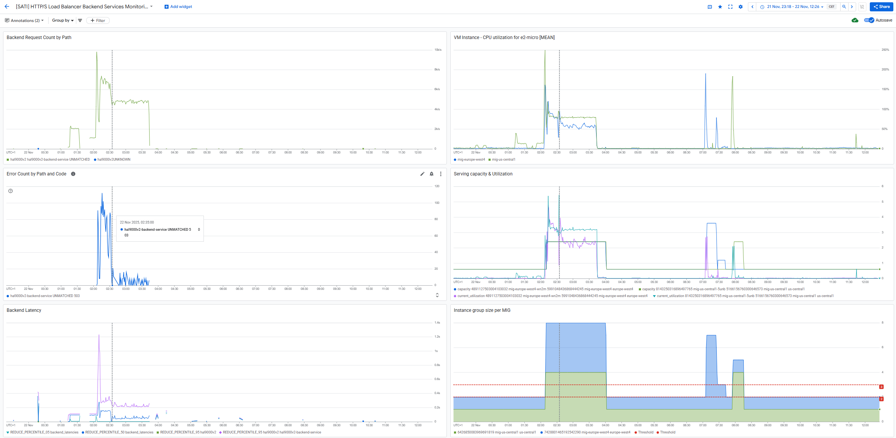
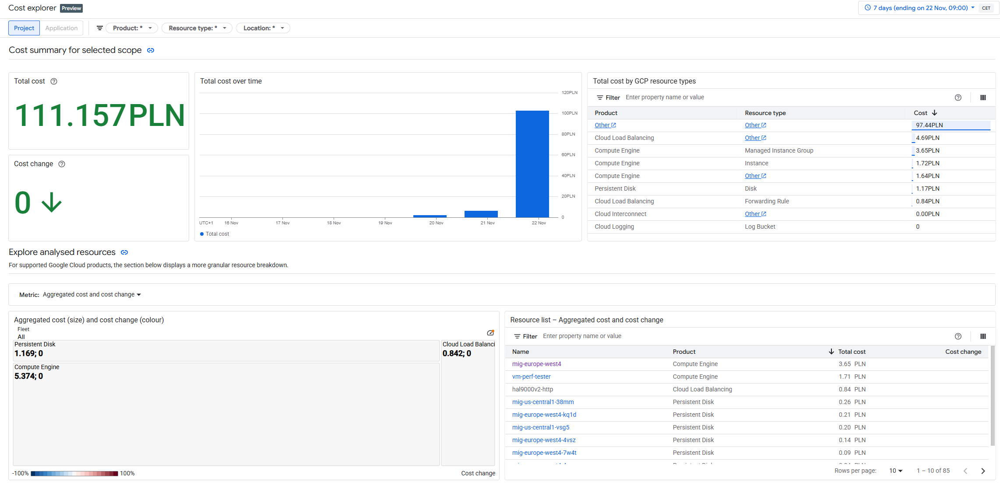
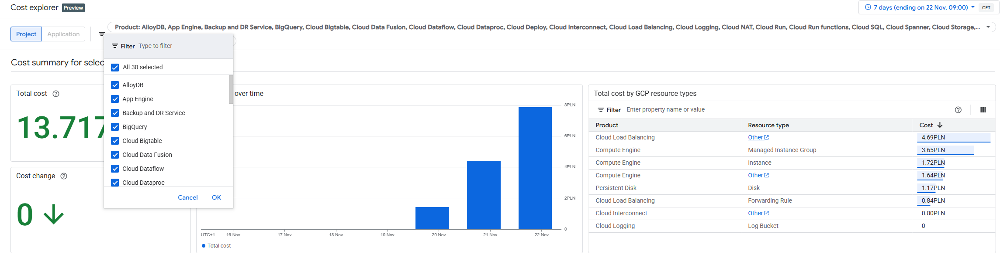
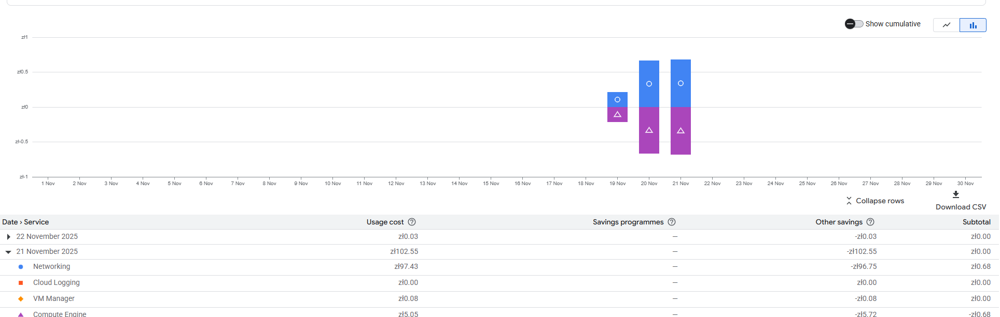
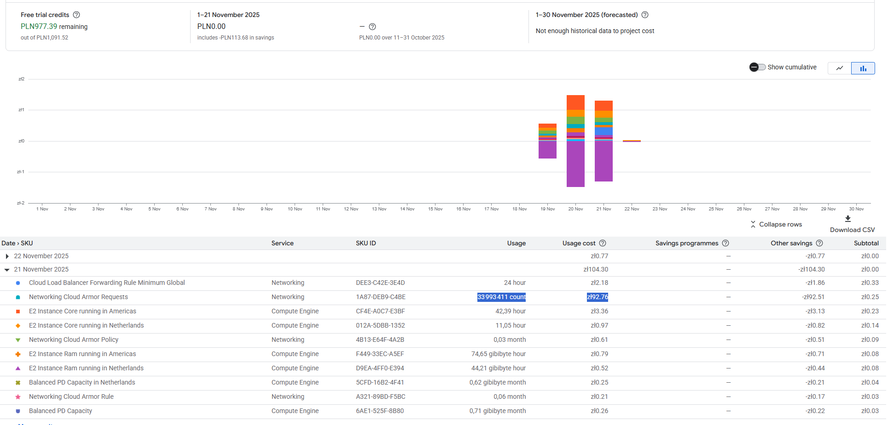
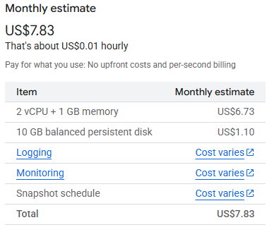
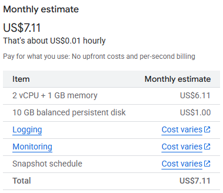

<div align="center">

<pre>
=============================================================================
  // REPORTING: PERFOPRMANCE & FINOPS (TASK E) //
=============================================================================
</pre>

<p><em>This document summarizes performance testing and FinOps impact.</em></p>

</div>

---
> **💫[!NOTE]💫👩‍🚀👩‍🚀👩‍🚀**

```Diff
+ Operator's Log:
```
> * This procedure assumes that **all layers** from previous steps are already deployed.
> * The goal is to verify autoscaling behaviour and check financial impact.
> * GUI steps are documented with screenshots captured from the GCP Console.

---

## 📹🚀 Step 1: Performance testing

> **[ RATIONALE: Use `ab` tool to simulate load ]**
> * Create a **dedicated VM** to run our tests from.
> * Validate both scaling up and down behaviour.

### Preparation:

Install `ab` on the load testing machine:
```bash
sudo apt-get install apache2-utils
```

Run test command:
```bash
ab -n 2000000 -c 1000  hal9000v2.spacetechnology.net/
```

### Results:
Following dashboard shows LB autoscaling behavior:


[Dashboard json code](sati_dashboard_v1.json)


**Interesting notes:**
1. MIGs scale up with increased load.
2. Traffic is initially sent to MIG in closes region, but as traffic increases, it is spread across both regions.
3. Peak in failed requests during VM startup (can be solved by enabling standby pool)
4. MIG scale down with decreased load.
5. Due to our very small VM size (e2-micro), autoscaling based on cpu utilization is not a best solution. Random CPU spikes can trigger autoscaling and increase our costs. 


## 💸 Step 2: Finances

### Scary stuff:

Cloud is not nice and fluffy, it **is** a scary place:

We typed a single line inside a single VM:
```bash
nadi4400@vm-perf-tester:~$ ab -n 20000000 -c 1000  hal9000v2.spacetechnology.net/
```

Then, next day we wake up to this:


What is the mysterious `other`?
If we Select all products, we see this:


If we go to Billing, it blames network:



Only the Billing by SKU view shows the truth:


By enabling Cloud Armor for our backend, we increased our costs almost **100 times**.
**Ups...**

**Note: - billing is horrible ⚠️**
```Diff
- Data can be delayed by 24 hours or more.
- It cannot show cost per hour, only per day.
- Exporting billing data to BigQuery is supposed to fix it, but it will take up to 5 days to finish.
- Cost monitoring shows costs were incurred on 22th, Billing says it's on 21th.   
```

### Actual pricing impact of scaling:

...is simply cost of extra VMs, as billed (per time):

EU:



US:



